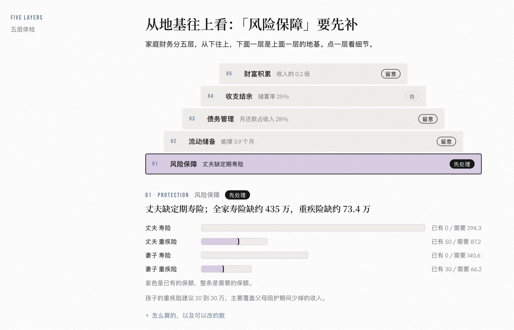
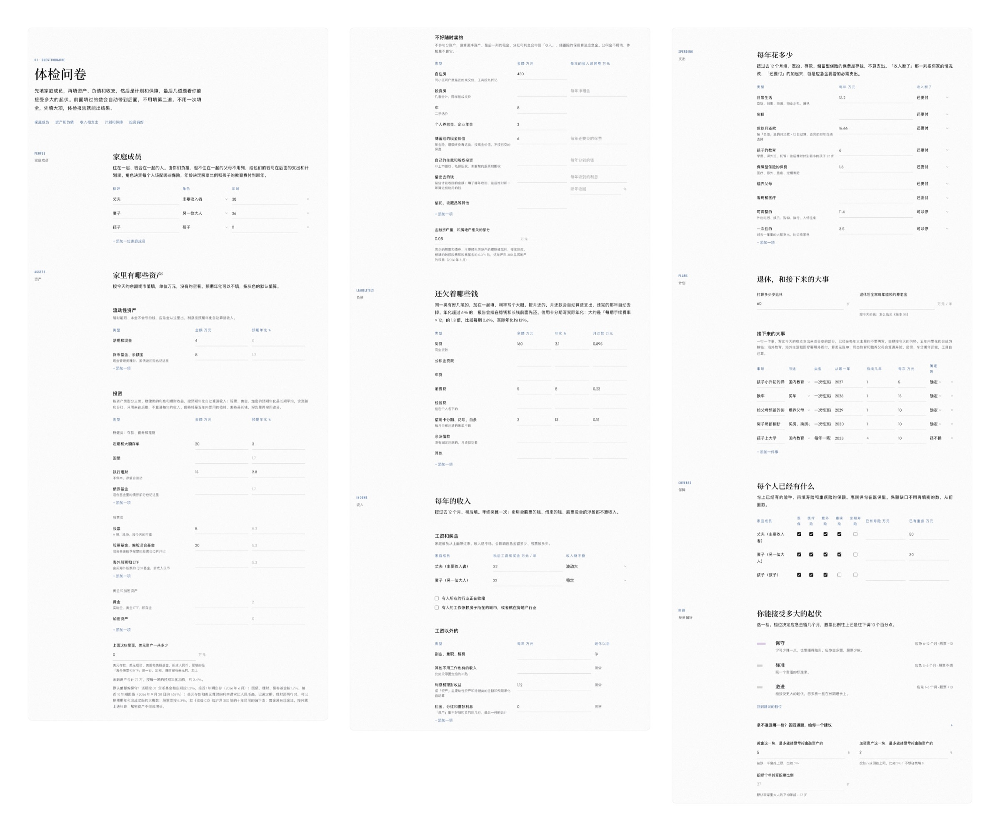
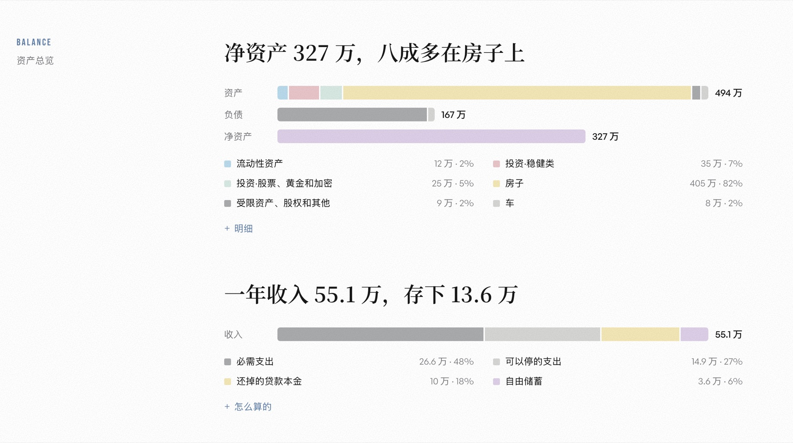
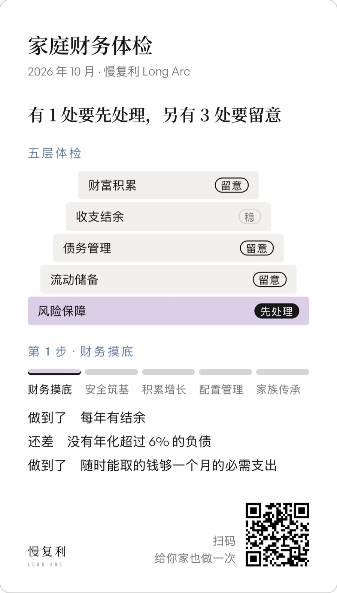
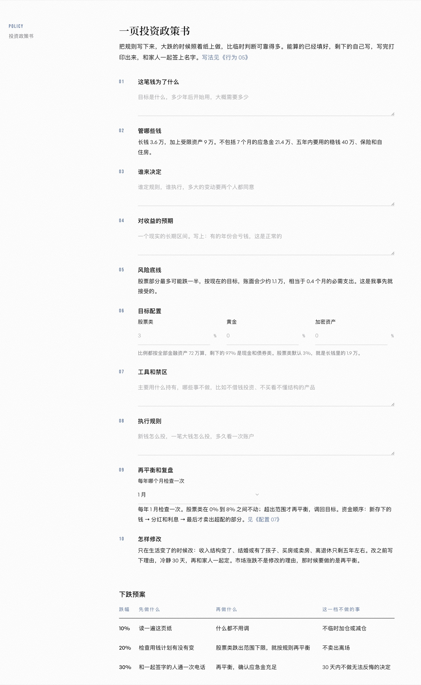

# 家庭财务体检 · household-checkup

[English](README.en.md)

**填写一份家庭财务体检问卷，彻底了解财务健康状态，再拿到一页家庭投资政策书。不用注册，数据只存在你自己的浏览器里，不推荐任何产品。**

在线使用：**[longarcsociety.com/tools/checkup](https://longarcsociety.com/tools/checkup)**

很多人做投资，看的是单一资产的回报率：这只基金去年涨了多少，那个项目能翻几倍。容易忽略的是，这些钱最后都是一个家庭的钱，要放在一起看：保障够不够，应急的钱在哪，负债压力多大，所有资产加起来又是怎么配的。

我自己最开始就踩过这个坑。那时候没有完整的配置概念，把很多钱放在了一级市场（没上市的公司股权），后来回头看，是很有问题的。而且很多人的资产分散在不同的软件里，银行、券商、支付宝各管一块，从来没有把所有资产放在一起完整地看过一次。

所以这个工具做的第一件事，是把全家的钱放到一张表上。放在一起，先后也就清楚了：保障、应急金、负债、结余，最后才是长期投资。股权投资占到净资产两成以上，它也会提醒你把股票比例往保守那档调。

市面上的「理财体检」，很多是卖产品的入口。我把这套方法做成了一个不卖东西的版本，代码全部公开，数据有没有上传，谁都可以自己查。



## 它能做什么

分三部分：

1. **体检问卷**：先填家庭成员，再填资产、负债、收入、支出、计划和保障。每个数只填一次，前面填过的会自动带到后面；能算出来的不问，比如利息、贷款月还款，预填好了，也可以改。
2. **体检报告**：
   - **资产总览**：净资产多少、钱都在哪、一年存下多少。
   - **你在哪一步**：财务摸底 → 安全筑基 → 积累增长 → 配置管理 → 家族传承。只讲当前这一步要做到什么，后面几步点开可以先看看。
   - **五层体检**：风险保障、流动储备、债务管理、收支结余、财富积累，每层给一个状态（稳、留意、先处理），点一层看细节。
   - **钱该怎么放**：活钱、稳钱、长钱各该有多少，长钱里股票放多少；收入断了能撑几个月，股市跌一半会少多少钱。
   - **行动清单**：现在做的几件事，和以后再做的。
   - **存成图片或 PDF**：分享图默认不带金额，放哪些部分自己选；二维码指回工具。
3. **投资政策书**：私人银行和投资顾问给客户写的那一页纸，普通家庭也可以有一页。能算的已经按报告填好，剩下的自己写，打印出来和家人一起签字，附 10%、20%、30% 三档下跌时的预案。

| 问卷 | 资产总览 |
|---|---|
|  |  |

| 分享图 | 投资政策书 |
|---|---|
|  |  |

截图用的是工具里的示例家庭：夫妻 38 岁和 36 岁，孩子 11 岁。点页面上的「填入示例家庭」就能看到同样的结果。

## 适合谁

- 想把全家的钱完整摸清一次的人，家底多少都可以。钱越少，越该先看底下那几层。
- 两个人一起管钱、想先把规则对齐的家庭。
- 想自己做配置、不想被推销的人。

不太适合：想天天看持仓、记账的人，这是一次性的体检；想知道具体买哪只基金的人，工具只算类别和金额。

## 怎么用

- **在线**：打开 [longarcsociety.com/tools/checkup](https://longarcsociety.com/tools/checkup)。
- **下载到本地**：点这个页面右上角的 Code → Download ZIP，解压后双击 `index.html`。字体要联网才加载，没网时用系统字体，功能都在。
- **自己部署**：全是静态文件，没有构建步骤，放到 GitHub Pages、Netlify、Vercel 都可以。

## 数据和隐私

- 你填的数只存在当前浏览器的 localStorage 里，不上传，页面里没有统计代码。
- 换设备或清理浏览器之前，点「备份数据」导出一个 JSON 文件，到新设备上「恢复备份」。
- 「导出给 AI」会生成一份 Markdown 摘要。想和 AI 聊结果，发不发、发给谁，由你决定。
- 页面只会从网上加载字体。二维码和生成图片的两个组件都在 `lib/` 里，不连外网。

## 方法

每一条规则、每一个默认值和参考线的出处，都写在 [docs/方法说明.md](docs/方法说明.md)。为什么这样定，可以读慢复利「[投资配置](https://longarcsociety.com/assets/invest)」系列，52 篇文章，从家庭财务三张表讲到传承。

报告附录里的假设都可以改：应急金月数、工资和支出的涨幅、通胀、提取率、推演到几岁。

**这不是投资建议。** 报告里的数都是「按这套方法算出的数」，不推荐任何基金、产品和个股，最后的比例由你自己定。

## 文件

```
index.html        页面
checkup.js        问卷、计算和报告，都在这一个文件里
site.css          样式
site.js           页面入场动效
lib/              qrcode-generator（二维码）、html2canvas（生成图片），都是 MIT 许可
assets/           慢复利的标识
docs/方法说明.md   计算规则和出处
```

想改成你自己的版本：分享图上的二维码由 `checkup.js` 里的 `SHARE_URL` 决定，换成你的网址就行；标识在 `assets/` 和页面的页头页脚里。

这个仓库由慢复利网站上的正本生成，是一个个人项目，我会按自己的节奏偶尔更新。欢迎 fork，改成你自己的版本。

## 许可

代码用 [MIT](LICENSE) 许可。「慢复利 Long Arc」的名字和标识（`assets/` 里的图形、页面上的 Logo）不在授权范围内，fork 之后请换成你自己的。
